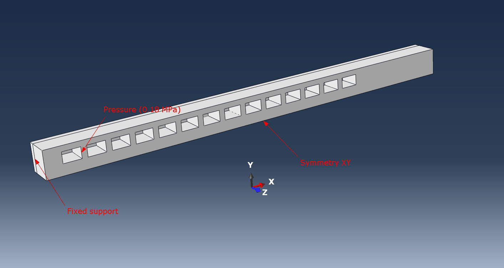
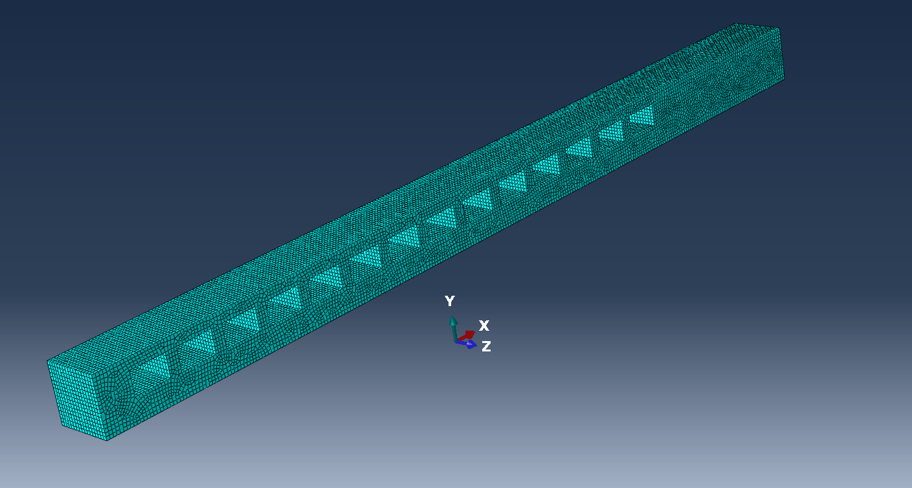
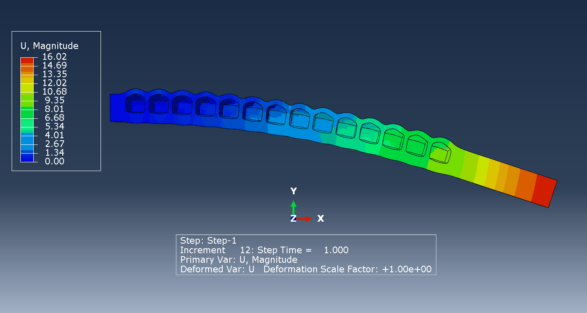
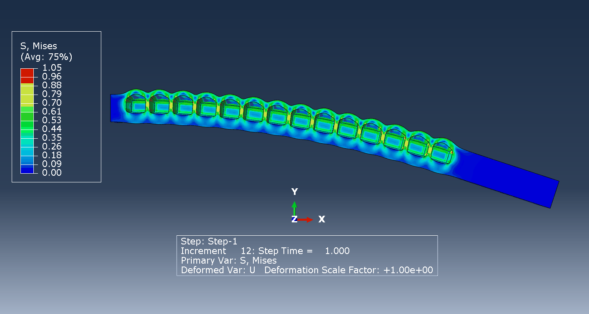
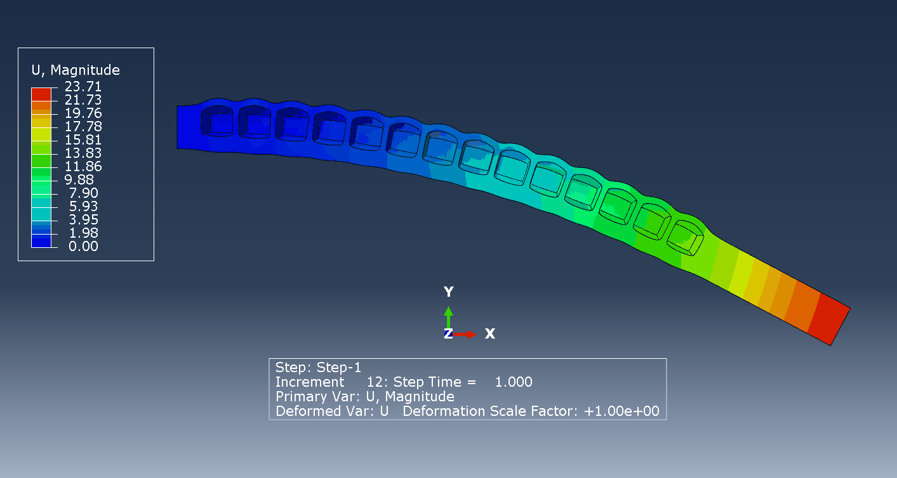
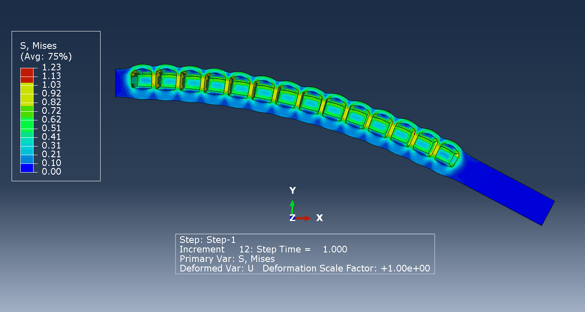
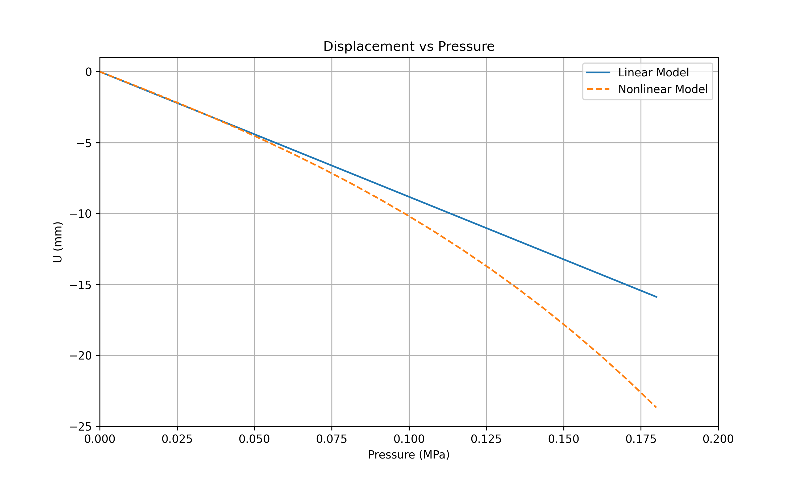
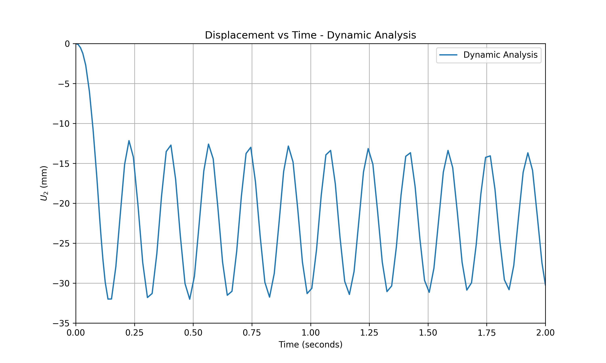

# ABAQUS simulation of a pneumatic finger

## Application

Pneumatically controlled fingers with internal cavities are used in robotic arms operated remotely by surgeons. Such a finger can be pneumatically controlled by the application of pressure in the cavities achieving precise bending deformations in the fingers enabling dexterity. Such fingers are generally made up of a soft polymer materials such as PDMS (Polydimethylsiloxane). 
PDMS has a low Young's modulus and a poissons ratio close to 0.5 (~0.48) which makes it almost incompressible.

## Simulation and boundary conditions

Shown below is one half of a pneumatic finger with dimensions of 80 x 5 x 5.1 $mm^3$ with cavities of dimensions 3.2 x 2 x 4 $mm^3$. The model is setup in ABAQUS with fixed support on the left face of the finger and a pressure of 0.18 MPa applied to all the faces of the cavities. Since we are only simulating one half of the model, a symmetry boundary condition is applied on the XY plane ($U_z = UR_x = UR_y = 0$).

## Meshing

The model is meshed with ~ 76000 linear hybrid incompatible mode (C3D8IH) elements. It is recommended to use hybrid elements in order to account for volumetric locking seen in incompressible elements. The mesh element also has incompatible modes to remove the artificial shear stresses that occur as a result of bending stresses. 

## Analysis

The model is solved using a static structural analysis by specifying an isotropic material for the finger. Two cases are looked at: (i) linear and, (ii) large deformation approximation. In the case of nonlinear deformation, the strain includes second order terms that are neglected in the linear approximation. 

## Results

### Linear model

The contour of deformation magnitude and Von-Mises stress are shown below

### Non-Linear model

The contour of deformation magnitude and Von-Mises stress are shown below

## Discussion

The deformations and stresses in the nonlinear analysis is higher than the linear case whihc is expected. The plot of deformation magnitude at a point on the right end of the finger shows this clearly.

# Modal Analysis

Modal analysis is performed with density specified as 965 $\frac{kg}{m^3}$. The first 4 modes occur at 5.75 Hz, 36.73 Hz, 98.33 Hz and 130.32 Hz. The first 3 modes are flexural modes and the 4th mode is a longitudinal mode.

https://github.com/user-attachments/assets/f3ff75d1-61ba-46d8-84e3-f0536397b3c4

https://github.com/user-attachments/assets/a0f7e448-c851-4a9e-8928-30a1acf6f09f

https://github.com/user-attachments/assets/3967dda8-c533-43d6-9dcf-80fab5c34446

https://github.com/user-attachments/assets/acea3fe9-8ddb-473f-9aa1-1dc00dee5aa2

# Transient Analysis

Transient analysis was performed using a dynamic implicit analysis. Implicit analysis solves an equation involving the current state of a system as well as the state of the system at a later time. The pressure load was ramped to 0.18 MPa in 0.1 seconds and was kept at 0.18 MPa for a time period of 2 seconds. A plot of the y-displacement at the end of the finger as a funcion of time is shown below

An animation of the displacement field is show below

https://github.com/user-attachments/assets/4fffd099-f304-4b57-85a5-eb12a311aa44

The displacement plot shows a sinusoidal variation of displacement with time. If we were to extend the simulation to around 15 seconds, we will obtain the static solution of the finger as seen in the section above.

